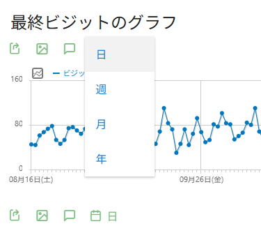

# EvolutionPeriodSwitcher - Matomo Plugin

Matomoで日付範囲（range）を選んでいるときに、推移グラフの表示単位を日・週・月・年で切り替えられるようにするプラグインです。LLMにガッと作らせたので色々雑です。

## 背景

Matomo標準では、日付範囲（range）で推移グラフを見ると表示単位が自動で決まり、ユーザーが切り替えることができません。このプラグインを入れると、グラフ上の期間切り替えボタン（日・週・月・年）が有効になり、好きな粒度でデータを確認できるようになります。

## スクリーンショット



## 機能

- **期間切り替えボタンの有効化** — range選択時にグラフ上部の日/週/月/年ボタンが表示される
- **クリックで粒度変更** — ボタンを押すとグラフが再読み込みされ、選んだ単位で表示される
- **range コンテキストの維持** — 切り替えてもURLの `period=range` と日付範囲はそのまま保持される

## 仕組み

### サーバーサイド

1. **`EvolutionPeriodSwitcher.php`** — `ViewDataTable.configure.end` と `Visualization.beforeRender` イベントをフックし、`period=range` のときにグラフの期間切り替えUIを有効化
2. **`OverridableEvolutionPeriodSelector.php`** — Matomo標準の `EvolutionPeriodSelector` を継承し、リクエストパラメーター `force_evolution_period` が渡された場合にその値を表示単位として使用
3. **`config/config.php`** — DIコンテナで `EvolutionPeriodSelector` を `OverridableEvolutionPeriodSelector` に差し替え

### クライアントサイド

**`evolutionPeriodSwitcher.js`** — 推移グラフの期間切り替えボタンのクリックハンドラを上書きし、`period=range` を維持したまま `force_evolution_period` パラメーターを付与してグラフを再読み込み

## 動作確認環境

- Matomo 5.7.1
  - 5.0.0以上をインストール要件にしてますが動作確認してないです
- PHP 8.3.8
  - 確認してませんが、7以降なら動くと思います

## インストール方法

1. このリポジトリをダウンロードする
2. EvolutionPeriodSwitcherディレクトリをzipにする
3. Matomoの管理者画面を開き、プラグインをアップロードし有効化する

## 使い方

1. プラグインを有効化する
2. Matomoのダッシュボードで日付ピッカーから **日付範囲（range）** を選択する
3. 推移グラフ上に日・週・月・年の切り替えボタンが表示される
4. ボタンをクリックするとグラフの表示粒度が切り替わる

## ファイル構成

```
EvolutionPeriodSwitcher/
├── plugin.json                              # プラグインメタ情報
├── EvolutionPeriodSwitcher.php              # プラグインエントリーポイント（イベントフック）
├── OverridableEvolutionPeriodSelector.php   # 期間セレクターの上書きクラス
├── config/
│   └── config.php                           # DIコンテナ設定
└── javascripts/
    └── evolutionPeriodSwitcher.js           # クライアントサイドの期間切り替え処理
```
